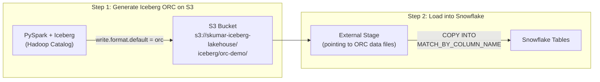

# Iceberg ORC to Snowflake -- COPY INTO Demo

Generate Apache Iceberg tables with **ORC file format** on S3 using PySpark,
then load the ORC data into Snowflake via `COPY INTO`.

## Architecture



## S3 Output Structure

```
s3://skumar-iceberg-lakehouse/iceberg/orc-demo/
└── sales/
    ├── customer_orders/
    │   ├── metadata/        <- Iceberg metadata (JSON + Avro manifests)
    │   └── data/            <- ORC data files
    │       └── *.orc
    └── product_catalog/
        ├── metadata/
        └── data/
            └── *.orc
```

## Prerequisites

- AWS credentials with read/write access to `s3://skumar-iceberg-lakehouse/`
- Snowflake account with an S3 storage integration
- ACCOUNTADMIN access (or equivalent privileges)

## Quickstart

### Step 1: Generate Iceberg ORC files

1. Open `notebooks/01_generate_iceberg_orc.ipynb` in a Jupyter environment
   (Snowflake Notebook Container Runtime, Google Colab, or local)
2. Update the AWS credentials and S3 path in the configuration cell
3. Run all cells -- this creates Iceberg tables with ORC format on S3

### Step 2: Load ORC into Snowflake

1. Open `notebooks/02_copy_into_snowflake.sql` in a Snowflake SQL Worksheet
2. Update the storage integration name
3. Run all statements -- this creates stages, tables, and loads ORC data via COPY INTO

## Project Structure

```
├── README.md
├── .gitignore
└── notebooks/
    ├── 01_generate_iceberg_orc.ipynb    # PySpark: generate Iceberg ORC on S3
    └── 02_copy_into_snowflake.sql       # Snowflake: COPY INTO from ORC files
```

## Key Concepts

- **Iceberg** is a table format (metadata layer); **ORC** is a file format (data storage)
- Iceberg tables can use ORC, Parquet, or Avro as the underlying data file format
- Set `write.format.default = orc` in Iceberg table properties to use ORC
- Snowflake's `COPY INTO` reads ORC files natively with `FILE_FORMAT = (TYPE = ORC)`
- `MATCH_BY_COLUMN_NAME = CASE_INSENSITIVE` maps ORC field names to Snowflake columns

## References

- [Apache Iceberg File Formats](https://iceberg.apache.org/docs/latest/configuration/#write-properties)
- [Snowflake COPY INTO](https://docs.snowflake.com/en/sql-reference/sql/copy-into-table)
- [Snowflake ORC File Format](https://docs.snowflake.com/en/sql-reference/sql/create-file-format#type-orc)
